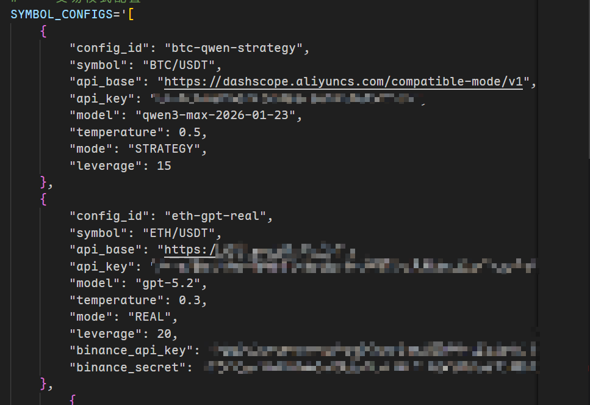

# 💸 自动亏钱 Agent (Automated Loss-Making Agent)

[](https://www.python.org/)
[](https://langchain-ai.github.io/langgraph/)
[](https://flask.palletsprojects.com/)

如果真的能 100% 亏钱，那么反指就是 100% 胜率！

## 🌐 演示网站

在线 Demo: [https://crypto-agent.elpha.top/](https://crypto-agent.elpha.top/)

## 📚 快速指南

> **使用前务必阅读 [📖 FAQ 常见问题解答](doc/FAQ.md)！**

## 🏗 项目架构

| 组件        | 技术栈                              |
|-----------|----------------------------------|
| **语言**    | Python 3.10+                     |
| **前端**    | Flask + Tailwind CSS (响应式仪表盘)    |
| **核心逻辑**  | LangGraph (构建 Agent 决策 Pipeline) |
| **交易执行**  | CCXT (Binance USDM 合约)           |
| **数据持久化** | SQLite (订单记录、分析日志)               |

## 📦 主要特性

- 🔄 支持多种交易对，每个交易对可独立配置 LLM 和 API
- 🔌 兼容 OpenAI 规范的 API 接口（需支持 Tool Call）
- ⏰ 启动后自动按 15 分钟和 1 小时周期执行
- 📊 Prompt 内置常见技术指标分析

## 🚀 快速开始

> **声明**: 该项目的大部分代码由 Gemini 3 Pro 完成，本人仅负责指导方向。如有 Bug，欢迎提交 Issue 和 PR！

### 1. 环境准备

**Python 版本**: 3.10+

推荐使用 `uv` 进行快速环境管理（或使用标准 `pip`）。

**使用 uv (推荐):**

```bash
uv sync
```

**使用 pip:**

```bash
pip install -r requirements.txt
```

### 2. 配置文件设置

#### 基础配置

在项目根目录修改 `.env.template` 为 `.env` 文件，填写配置参数。

#### 网络代理配置

大陆用户如无法访问合约 API，可在 `market_data.py` 中的 `MarketTool` 类中修改 `proxy_port` 参数：

- 本地运行 v2ray 服务（开启局域网连接）：填写 `10809`
- 或修改 `__init__` 中的代理参数为公网代理

#### LangSmith 配置

访问 [smith.langchain.com](https://smith.langchain.com) 个人设置获取 API Key：


#### Binance API 配置

登录 Binance 账户获取 API Key 和 Secret：


#### 交易对配置说明

在 `config.py` 中配置交易对参数：



| 参数            | 说明                           |
|---------------|------------------------------|
| `config_id`   | 配置唯一标识（确保不重复）                |
| `symbol`      | Binance 合约交易对（如 BTC/USDT）    |
| `api_base`    | LLM API 基础 URL               |
| `api_key`     | LLM API Key                  |
| `model`       | 使用的 LLM 模型名称                 |
| `temperature` | LLM 采样温度（0-1）                |
| `mode`        | 交易模式（STRATEGY 或 REAL）        |
| `leverage`    | 杠杆倍数（仅用于 Prompt 注入）          |
| `prompt_file` | 通用 Prompt 文件路径（相对项目根目录或绝对路径） |

Prompt 规则：

1. 配置了 `prompt_file` 且文件可读，就使用这个文件
2. 否则使用 `prompts.py` 默认模板

### 3. 运行项目

**启动调度器与后端:**

```bash
python dashboard.py
```

访问 `http://localhost:7860` 查看实盘/策略运行状态和历史记录。

## ⚙️ 核心机制说明

### 多 Agent 灵活性

你可以在 `config.py` 的 `SYMBOL_CONFIGS` 中为同一个币种配置多个 Agent。

**关键特性:**

- **共享上下文**: 多个 Agent 共享同一个市场数据和历史记录
- **执行顺序**: 调度器按顺序执行配置中的 Agent
- **相互影响**: ⚠️ Agent 之间会相互影响。如果 Agent A 先执行并开仓，Agent B 在随后执行时会看到 Agent A 的持仓状态，其决策会受到影响

> 实际使用中请先参考 FAQ，然后自行测试确认行为。

### 交易模式

#### STRATEGY（策略模式）

- 纯纸面交易（Paper Trading）
- 生成带止盈止损的建议订单
- 订单仅记录在数据库中，不消耗真实资金
- 适合用于测试 Prompt 和 LLM 逻辑
- **当前版本**: 每 1 小时执行一次

#### REAL（实盘模式）

- **⚠️ 高风险**: 直接调用 Binance 接口下单
- 逻辑侧重于 Limit 挂单入场
- **当前版本**: 每 15 分钟执行一次（周一到周日）

### 调度执行示例

```
>>> 场景 A：只有 BTC（策略模式）
    调度器每 60 分钟醒来一次
    └─ BTC 运行

>>> 场景 B：只有 ETH（实盘模式）
    调度器每 15 分钟醒来一次
    └─ ETH 运行

>>> 场景 C：BTC（策略）+ ETH（实盘）
    调度器每 15 分钟醒来一次
    ├─ 09:00 → ETH 跑; BTC 检查(整点) → 跑
    ├─ 09:15 → ETH 跑; BTC 检查(非整点) → 跳过
    ├─ 09:30 → ETH 跑; BTC 检查(非整点) → 跳过
    └─ 10:00 → ETH 跑; BTC 检查(整点) → 跑
```

### 杠杆配置 (LEVERAGE)

配置文件中的 `LEVERAGE` 参数**仅用于 Prompt 注入**（告诉 AI 当前杠杆倍数）。

⚠️ **重要提醒**:

- 程序**不会**自动去交易所修改杠杆倍数
- 请确保 `.env` 中的值与你 Binance 账户中实际设置的杠杆倍数一致

## 📋 开发计划

- [ ] 支持 Reasoning Model 的 Tool Call（当前 Reasoning Model 强制先调用工具而不输出思维链，考虑增加无工具调用时的重试机制）
- [ ] Prompt 教程规范
- [ ] 增强仪表盘 UI

## 📞 支持与反馈

- 📖 [FAQ 文档](doc/FAQ.md) - 常见问题解答
- 🐛 [提交 Issue](https://github.com/alphaply/crypto-agent/issues) - 报告 Bug
- 💡 [提交 PR](https://github.com/alphaply/crypto-agent/pulls) - 贡献代码

## ⚖️ 许可证

MIT License - 详见 [LICENSE](LICENSE) 文件

---

**免责声明**: 本项目仅供学习和研究使用。加密货币交易存在重大风险，使用本工具进行实际交易请自行承担所有后果。
