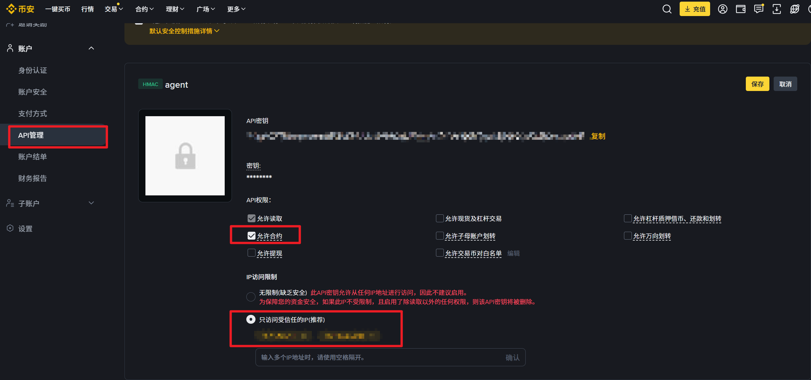
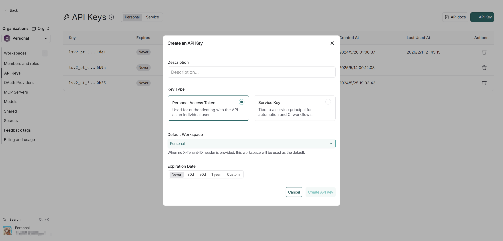

# 💸 自动亏钱 Agent (Automated Loss-Making Agent) V0.3

基于 **LLM (大语言模型)** 和 **LangGraph** 构建的全自动化加密货币交易系统。
> *“如果真的能 100% 亏钱，那么反指就是 100% 胜率！”*
## ✨ 核心特色

- **🤖 多 Agent 架构**: 基于 LangGraph 状态机，支持为每个交易对配置独立的 LLM、杠杆、Prompt 及策略参数。
- **🤑三大交易模式**:
    - 🔴 **实盘模式 (REAL)**: 15m 高频扫描，直接调用交易所 API 进行合约对冲与套利。
    - 🔵 **策略模式 (STRATEGY)**: 1h 模拟挂单，用于测试高盈亏比 (R/R > 2.5) 的交易计划。
    - 🟢 **定投模式 (SPOT_DCA)**: **[新]** 现货定投逻辑，每日定时扫描市场支撑位，自动下达现货买入指令，平摊长期持仓成本。
- **⚙️ 可视化配置中心**: 告别手写 JSON，通过 Web 界面卡片式管理交易对，支持实时开关与热重载。
- **📝 Prompt 资源管理**: 集成 Prompt 编辑器，支持在线新建、编辑策略模板，并实现 Agent 的动态关联。
- **📊 深度统计与监控**: 自动捕获交易与聊天产生的 Token 消耗；拥有专属的多 Agent 对比视图与决策流水。
- **💬 智能交互聊天**: 支持与正在运行的 Agent 直接对话，通过人工审批 (Human-in-the-loop) 授权其执行交易工具。

---

## 🚀 更新日志

### [V0.4beta] - 2026-03-02
- **新增**: **定投模式 (SPOT_DCA)**，完美适配现货长期建仓需求。
- **优化**: 仪表盘全面支持三色模式（红/蓝/绿），视觉区分更直观。
- **Prompt**: 为定投模式内置 `dca.txt` 专用分析模板。
- **历史**: 历史记录页面支持模式过滤与彩色标签展示。

### [V0.3] - 2026-02-28
- **重构**: 引入多 Agent 选项卡系统，支持独立视窗查看分析与专属流水。
- **新增**: 可视化配置中心，支持全字段表单编辑与卡片式开关。

---

## ⚙️ 关键配置指引

### 1. 币安 API 配置 (Spot & Futures)
在 `.env` 中填入您的 API Key。请确保 API 拥有“允许读取”和“允许现货/合约交易”权限。

*注：建议开启 IP 白名单以保障资金安全。*

### 2. 开发者监控 (LangSmith)
如果您需要调试 Agent 的思维链或查看完整的 Trace 路径，请配置 LangSmith：

*提示：在 `.env` 中设置 `LANGCHAIN_TRACING_V2=true` 即可启用。*

---

## 🛠️ 未来计划 (TODO)

### [V0.2] - 2026-02-20
- **架构**: 迁移至 LangGraph，引入多 Agent 独立配置机制。
- **Web**: 建立 Flask Dashboard，支持基础分析历史查看。

### [V0.1] - 初始版本
- **核心**: 实现基础的市场数据抓取与 LLM 简单决策逻辑。

---

## 🛠️ 未来计划 (TODO)

- [ ] 检测并修复0.3版本的bug。评估claude的能力

---

## 📖 快速索引

- [🚀 安装与运行](docs/INSTALL.md)
- [⚙️ 详细配置指南](docs/CONFIG_GUIDE.md)
- [📊 成本与胜率测评](docs/COST_ESTIMATION.md)
- [❓ FAQ 常见问题](doc/FAQ.md)

---

**免责声明**: 本项目仅供学习研究。加密货币交易存在高风险，使用本工具产生的一切盈亏由使用者自行承担。
